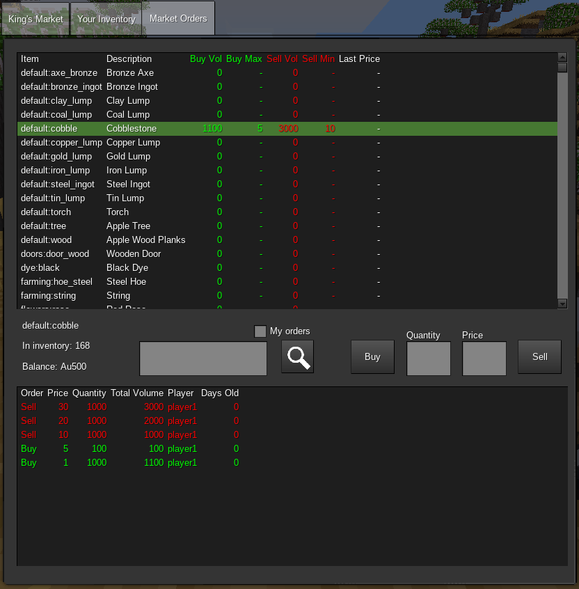

This mod implements marketplaces where players can post buy and sell offers for various items, allowing for organic market forces to determine the relative values of the resources in a world.

The basic market interface is the same across all markets and market types, but this mod allows for a variety of different ways that markets can be configured to support different playstyles. Markets can have restrictions on what they will allow to be bought and sold, different types of "currency", and can share a common inventory across multiple locations or can be localized to just one spot at the discretion of the server owner.

## Currency

Each market has one or more "currency" items defined that are treated differently from the other items that can be bought and sold there. Currency items are translated into a player's currency balance rather than being bought and sold directly.

For example, the default market offered by this mod has this currency definition:
	
	{
		["default:gold_ingot"] = 1000,
		["commoditymarket:gold_coin"] = 1
	}
	
When a gold ingot is added to the player's market account it turns into 1000 units of currency. When a gold coin is added it turns into 1 unit of currency. You can't buy and sell gold directly in this market, it is instead the "standard" by which the value of other items is measured.

There's no reason that all markets in a given world have to use the same currency. Having variety in currency types adds flavour to the world and also introduces opportunities for enterprising traders to make a profit by moneychanging between different marketplaces.

## Account Inventory

In addition to tracking a player's currency balance, each player's account has an inventory that serves as a holding area for items that are destined to be sold or that have been bought by the player but not yet retrieved. This inventory is a bit different from the standard Minetest inventory in that it doesn't hold individual item "stacks", allowing for larger quantities of items to be accumulated than would otherwise be practical. If a player needs to buy 20,000 stone bricks for a major construction project then their account's inventory will hold that.

To prevent abuse of the market inventory as a free storage space, or just to add some unique flavor to a particular market, a limit on the inventory's size can be added. This limit only affects transfers from a player's personal inventory into the market inventory; the limit can be exceeded by incoming items being sold to the player.

Note that tools cannot be added to the market inventory if they have any wear on them, nor can the market handle items with attached metadata (such as books that have had text added to them).

## Placing a "Buy" Order

A buy order is an offer to give a certain amount of currency in exchange for a particular type of item. To place a buy order go to the "Market Orders" tab of the market's interface and select the item from the list of items on the market. If the item isn't listed it may be that the market is simply "unaware" of the item's existence; try placing an example of the item into your personal inventory and if the item is permitted on the market a new entry will be added to Market Orders.

Enter the quanitity and price you desire and then click the "buy" button to place a buy order.

If there are already "sell" orders for the item when you place a buy order, some or all of your buy order might be immediately fulfilled provided you are offering a sufficient price. Your purchases will be made at the price that the sell orders have been set to - if you were willing to pay 15 units of currency per item but someone was already offering to sell for 2 units of currency per item, you only pay 2 units for each of that offer's items.

If there aren't enough compatible sell orders to fulfil your buy order, the remainder will be placed into the market and made available for future sellers to see and fulfil if they agree to your price. Your buy order will immediately deduct the currency required for it from your account's balance, but if you cancel your order you will get that currency back - it's not gone until the order is actually fulfilled.

Double-click on your order in the orders list to cancel it.

## Placing a "Sell" Order

Sell orders are an offer of a certain amount of an item and a price you're willing to accept in exchange for them. They're placed in a similar manner to buy orders, except by clicking the "sell" button instead of the "buy" button.

If there are already buyers with buy orders that meet or exceed your price, some or all of your sell order may be immediately fulfilled. You'll be paid the price that the buyers are offering rather than the amount you're demanding.

If any of your sell offer is left unfulfilled, the sell order will be added to the market for future buyers to see. The items for this offer will be immediately taken from your market inventory but if you cancel your order you will get those items back.

Double-click on your order in the orders list to cancel it.

## Commands

This mod has several commands that a server administrator can use:

* market.removeitem marketname item -- cancels all existing buy and sell orders for an item and removes its entry from the market tab. This is useful if you've changed what items are permitted in a particular market and need to clear out items that are no longer allowed.
* market.show marketname -- opens the market's formspec

## Registering a market

The file "default_markets.lua" contains a number of pre-defined markets that provide examples of what's possible with this mod. They can be enabled as-is with game settings and include:

* King's Market - a basic sort of "commoner's marketplace", only open during the day
* Night Market - the shadier side of commerce, only open during the night
* Trader's Caravan - a type of market that players can build and place themselves, with a small inventory capacity.
* Goblin Exchange - a strange marketplace that uses coal as a currency
* Undermarket - where dark powers make their trades, using Mese as a currency

All of these except for the Trader's Caravan are intended to be placed in specific locations by server administrators, they have on_dig methods that prevent them from being removed and don't have crafting recipes.